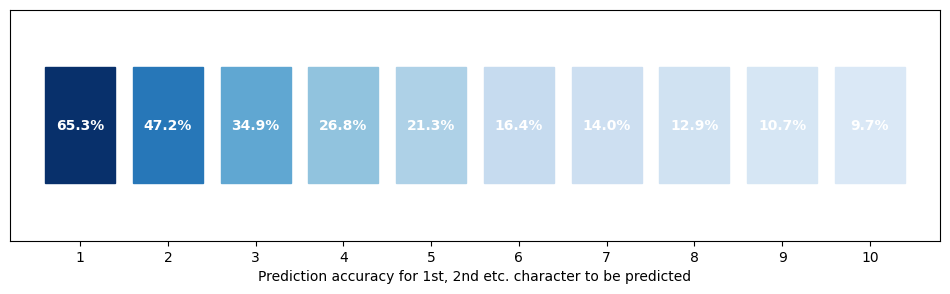
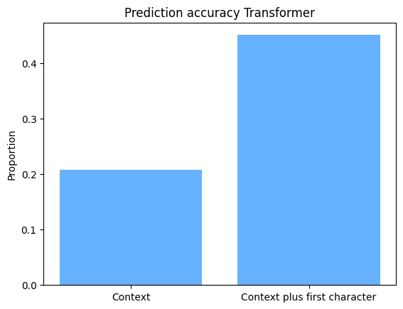

# NietzscheNext

Trains neural networks on the collected works of Friedrich Nietzsche to create an app for text completion (autocomplete). The general intuition is to train a model that can facilitate writing by autocompleting your words, based on your previous writings. 

Data was obtained from [Projekt Gutenberg](https://www.gutenberg.org/ebooks/author/779). The dataset comprises six texts totalling 1.8m characters or tokens. Of each text, 80 percent end up in the training set, the latter 20 percent end up in the test set. Train and test sets have 1,416,760 and 354,438 tokens, respectively. 

Neural nets are trained to predict the next character based on a given context length. First, I trained a transformer model (Karpathy 2022), based on a context length of 100 characters. First, Figure 1 shows the accuracy of predicting the next 1, 2 and so forth characters in a sequence. The first character is accurately predicted 65% of the time, which drops to 47% for the second and 35% for the third character. Prediction accuracy decreases as prediction error accumulates when predicting characters "far into the future". 

The accuracy of predicting the next full word in the sequence is at 20.5%. This probability more than doubles to 45.4% after adding additional information about the first character of the word: 

Second, a character-level Recurrent Neural Network (RNN) model was trained, with a context length of 80 characters. This model yields a test-set prediction accuracy of 17.3% for predicting the next word from context. This accuracy gets boosted to 36.4% when the model receives the first character of the word in question as additional information. Overall, the RNN performs worse than the transformer model.

Finally, further exploring the accuracy of the transformer model, it turns out that the target word is among the top-3 model predictions almost 40% of the time when predicting the next word based on context. When adding information about the first character of the target word, that accuracy rate increases to over 60%.

----
References:
Karpathy, Andrej. 2022. NanoGPT. https://github.com/karpathy/nanoGPT/tree/master

