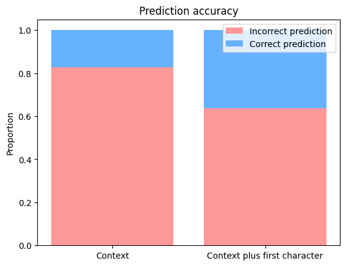
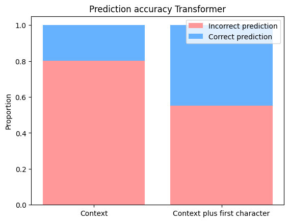

# NietzscheNext

Trains neural networks on the collected works of Friedrich Nietzsche to create an app for text completion (autocomplete). The general intuition is to train a model that can facilitate writing by autocompleting your words, based on your previous writings. 

Data was obtained from [Projekt Gutenberg](https://www.gutenberg.org/ebooks/author/779). The dataset comprises six texts totalling 1.8m characters or tokens. Of each text, two thirds end up in the training set, the latter one third ends up in the test set. Train and test sets have 1,180,649 and 590,549 tokens, respectively. In other words, the models are trained on two thirds of each text and tested on the latter third. 

Neural nets are trained to predict the next character based on a given context length. First, a character-level Recurrent Neural Network (RNN) model was trained, with a context length of 80 characters. This model yields a test-set prediction accuracy of 17.3% for predicting the next word from context. This accuracy gets boosted to 36.4% when the model receives the first character of the word in question as additional information: 

Second, I trained a transformer model (Karpathy 2022), also based on a context length of 80 characters. The prediction accuracy is at 20.5% and 45.4% after adding additional information about the first character of the word: 

----
References:
Karpathy, Andrej. 2022. NanoGPT. https://github.com/karpathy/nanoGPT/tree/master

